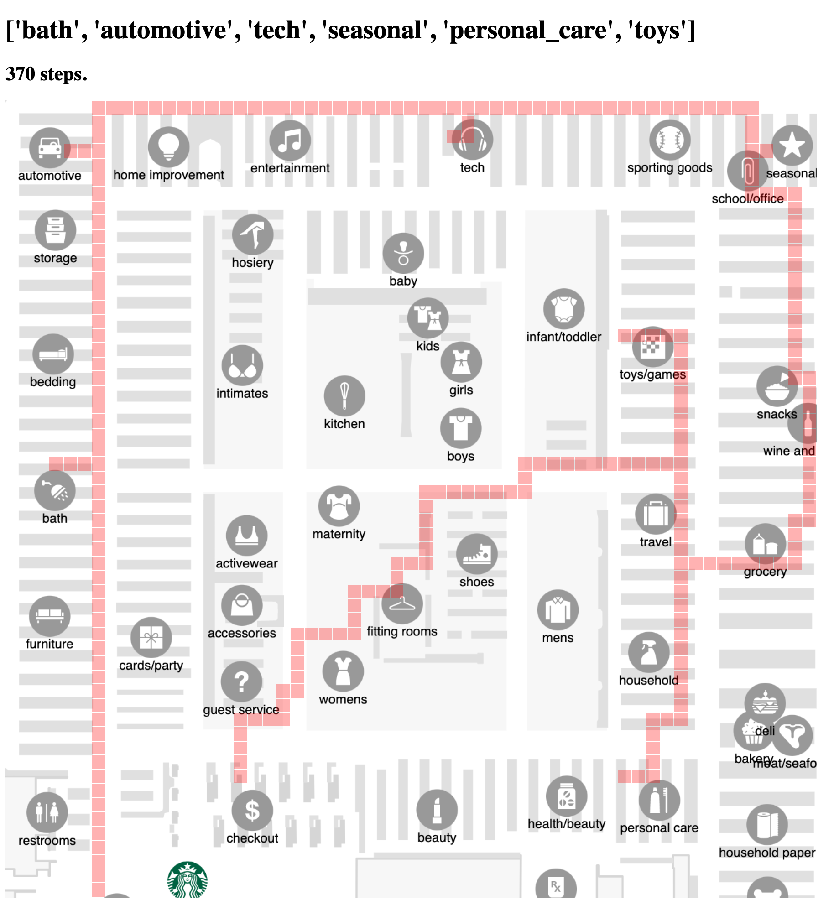

# Instore navigator 
Instore navigator is a web application that takes names 
and categories of items from a general store, generates an optimal path based on items that are entered, and displays the optimal path.  

## Features 
- [x] Takes in a list of shopping items and their categories.  
- [x] Utilizes a the A star algorithm to generate a path between two items.
- [x] Stores the distance between all items and generates the shortest path between the items using a general algorithm.
- [x] Overlays the optimal path to all items on a general store map. 

## Picture 
Given a JSON that contains a list of items and their catergories like this:

```
[
    {
        'name':'showerhead',
        'category':'bath'
    },
        {
        'name':'oil',
        'category':'automotive'
    },
    {
    'name':'easter egg',
    'category':'seasonal'}
    ,
    {'name':'phone',
    'category':'tech'},
    {
        'name':'showerhead',
        'category':'personal_care'
    },
      {
     'name':'barbie',
     'category':'toys'
    }
    ]
``` 
The application will generate a path like this: 



##  Notes
- To run this application, you must download Python 3.0 and flask.
- To start the application you can enter Python3 app.py on your terminal. 

## Open-source libraries used 
- [Python](https://www.python.org/download/releases/3.0/) - 3.8
- [Flask](https://flask.palletsprojects.com/en/2.0.x/)


## Acknowledgments 
- [A* Pathfinding Visualization Tutorial](https://www.youtube.com/watch?v=JtiK0DOeI4A)
- [Traveling salesman problem explanation](https://www.youtube.com/watch?v=cY4HiiFHO1o)
